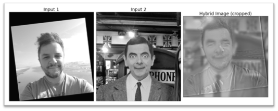

# Hybrid Images

## Hybrid image main result

Bellow are the original images (1 and 2), the FFT image of each of them, the filtered images (low-pass and high-pass), the FFT image of the filtered images, and finally, the hybrid image. 

Both images were filtered using a 2D gaussian filter (cv2.getGaussianKernel). In both cases, the optimal setting for sigma (low and high) was 20. The difference between the low-pass image and the high-pass image is the high-pass image is computed by subtracting the gaussian-filtered image from the original. 

The final illustration is a larger view of the hybrid image, cropped to its relevant portion, and including the FFT image.

## Hybrid image additional results
These images were filtered with the same method described for the “Hybrid Image main result”, except they received different parameters for sigma.

- Example a: sigma=15 both for low-pass and high-pass images. 

- Example b: sigma=15 for the low-pass image, and sigma=5 for the high-pass image. 

## Image enhancement tasks

### Task 1: contrast enhancement
For the first task, I implemented contrast enhancement using global histogram equalization. Looking at the histogram for the original image, there’s an opportunity to provide slightly better results if we distribute values better across the distribution of the image. Below, see the original photo and the histogram. 

I experimented through different values of alpha as a parameter for global histogram equalization and found that alpha=0.5 provided best results when applied to the value (“V”) channel. So the approach separates the channels in the HSV color space, applies global histogram equalization, and merges the channels back together. 

For this exercise, I implemented global histogram equalization from scratch, following Professor Hoiem’s lecture. 

In the enhanced picture, with the adjusted contrast, we get the following benefits:
- Much clearer details on the statue
- Easier to read the sign "The queen's walk"
- Better definition in the stone that holds the statue
- Better shadows in areas like the sidewalk near the iron fence

Also note that the values are better spread out through the histogram.

Please note: matplotlib will now show these pictures in higher resolution. So in order to visualize them in full fidelity, I write them to the file system. To put images next to each other, I use np.hstack. 

### Task 2: color enhancement
For the second task, I implemented color enhancement over a picture. 

For this task, I attempted two approaches: 
1. Histogram equalization on the “S” channel. For this approach, I explored the HSV color space to get the saturation channel to focus on intensity. I then applied histogram equalization to the saturation channel, and merged the image back together, preserving the H and V channels. 
2. On a second approach, I multiplied the values in the S channel by a constant. I found that even though this is a much simpler approach, it provided better results on this particular image. 

The image below shows the matplotlib output of the original image, followed by each of the approaches. 

Looking at the full fidelity files written to the filesystem (below), I prefer the simpler approach, which just multiplied the S channel by a constant. Notice how the details on the Ferris-wheel’s wagon are much brighter, as well as the parliament and the rest of the city. 

Here are the original and enhanced images: 

## Acknowledgments / Attribution
- All the images used in this project were authored by myself (Pericles Rocha). 
- Some of the code used in the global histogram equalization approach was inspired by the MATLAB demo which Professor Hoiem provided. 
- For the hybrid images, in order to show the results with a fifth column that’s taller than the previous ones, I wrote code inspired by this article from the Matplotlib documentation: https://matplotlib.org/stable/gallery/subplots_axes_and_figures/gridspec_and_subplots.html 
