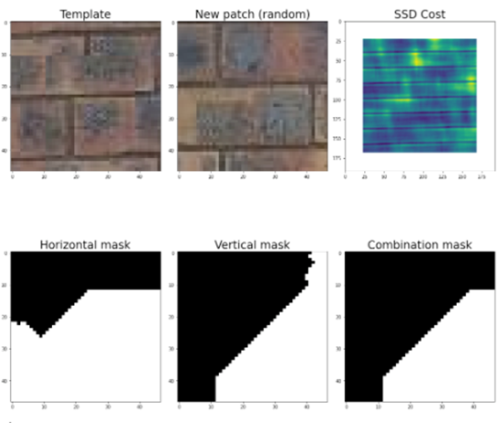

### CS 445 – Project 2 report

# Project 2: Image Quilting

## Introduction
I used three images as sample textures for this project:

 	 	 

There are a few reasons why I picked these textures to replicate the image quilting techniques: 
- The brick wall has convenient shape and block sizes that make the learning experience more productive. It’s easy to work with. 
- The garden pavers are similar to the brick wall, but it has no-standard brick sizes with patches that span 100 x 100 pixels in some cases.
- The old table has the dark space in between each wooden piece, which make an interesting repeatable pattern while still offering a varied texture on each wooden piece. 

These images will be used through the first three algorithms explored in this project. 

## Randomly Sampled Texture
For “Randomly Sampled Texture”, I randomly pick a patch of the size provided in each example and stack it next to the previous one. On my algorithm, I compute how many iterations will a loop perform based on the number of rows times the number of columns needed (in the code, it’s a nested loop). Let’s look at the results and learnings

Brick wall: 
- Patch size: 15
- Output size: 200

 	 

Note: I found that using a patch size of 15 was optimal due to the approximate height of each brick

Garden pavers: 
- Patch size: 50
- Output size: 500

 	 

Note: with an output size of 500, because there is no overlap in this exercise, the output image uses the whole canvas.
 
Old table:
- Patch size: 15
- Output size: 200

 	 

Note: what’s interesting to me about this texture is that the dark patches in between the wood pieces become an actual area used in patches on the destination, causing a bizarre result that looks like an algorithmic problem at first glance.

This is a great example that can benefit from a more elaborated way to get patches aligned to make the output image more natural. 

## Overlapping Patches

Overlapping patches calculates the sum of squared differences between a sample image and the output area to allow the program to choose the “least expensive” (less distant) connection between the patches. The result is a smooth continuation of the texture when new patches are added next to one another. 

Brick wall: 
- Patch size: 47
- Overlap: 11
- Tolerance: 1

 

Note: smaller patch sizes proved ineffective in this example, so I picked much larger patch sizes, the approximate size of the height of two bricks. The result looks very smooth, with minor defects. 
  
Garden pavers: 
- Patch size: 25
- Overlap: 11
- Tolerance: 3

 

Note: because there are some quite large tiles in the sample image, it’s interesting to see how the output image builds some very long continuous segments of stone. I thought the algorithm delivered outstanding results on this texture. 
 
Old table:
- Patch size: 45
- Overlap: 11
- Tolerance: 3

 

Note: there’s one minor issue I could not avoid with this template, which is the irregular space between the wood pieces in the output image. In the sample, every wood piece has the same width, but that’s not the case for the output image that I produced. Still, it provides a reasonably good output.  	Sample

## Seam Finding 
Similarly, these are the results obtained by enhancing the algorithm with Seam Finding. To observe the differences with the implementation from the previous exercise, I did not change any parameters: 

Brick wall: 
- Patch size: 47
- Overlap: 11
- Tolerance: 1

 
  
Garden pavers: 
- Patch size: 25
- Overlap: 11
- Tolerance: 3
 

 

Old table:
-	Patch size: 45
-	Overlap: 11
-	Tolerance: 3

 

The following shows the template (destination patch in the output image), a newly selected random patch, the ssd cost, and the horizontal, vertical and combined masks for a random patch: 

 

## Texture Transfer 
Texture transfer builds on the image quilting examples, adding an additional cost function that computes the destination output with a guidance image to build a texture that resembles the guidance. 

I worked two examples blending images provided and images of my own: 

1. Richard Feynman and grass texture with patch_size = 25, overlap = 11, tol = 3 and alpha = 0.5.

 
 
2. “Bread Pitt”: combination with the provided “toast” with a picture of Brad Pitt. Sample with patch_size = 25, overlap = 11, tol = 3 and alpha = 0.5. 

 
	 
## Acknowledgments / Attribution

- Images provided with the starter code: toast.jpg, feynman.tiff, bricks_small.jpg, 
- Images authored by the report author (Pericles Rocha): grass.jpg, pavers.jpg, table.jpg
- Internet images: brad.jpg (source: https://purepng.com/photo/21999/celebrities-brad-pitt)
