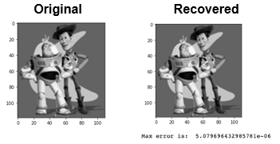

### CS 445 – Project 3 report

# Project 3: Gradient Domain Fusion

## Toy problem
The “Toy problem” exercise reconstructs an image from its gradient values, plus one pixel intensity. 

 

The result obtained recovers the original image with a max error of 5.079696432985781e-06.
 
## Poisson blending

This report includes three results for the “Poisson blending” algorithm: a favorite blending result, a good result and a failed result. Here are the images used, combined with their respective objects for illustration: 

 
1. Favorite result: an image of SpaceX’s Spaceship flying in Mars’ horizon. The original object image has a blue background with a chrome rocket which reflects the sky’s colors. It blends nicely with the Mars background when Poisson blending is used. Notice how the Spaceship’s chrome reflection now blended with the colors of the Martian sky. 

 

2. Another good result: an image of an astronaut sitting on the surface of Mars. In the original image, the surface has a different color tone from the background but still, when blended, the astronaut blends nicely with the new background.

 

3. A failed result: a man standing on the surface of planet Mars. The reason why I consider this a failed result, is that the original object image is changing too much in intensity and color when compared to the original. I note that the skin color and the clothes look much darker. Also, there are some bushes in the right-hand side of the object image which don’t look natural when blended with the background image. Finally, the background image is of a rocky surface, which doesn’t continue fluidly with the blended object image. Those are the reasons why I’m making this a failed result.

 

The reason for the actual failure comes from the fact that the background image has a texture which is not continuous, but the viewer expects to see the rock surface on the background. The object image omits this background from the head of the person until their foot – the extension of the object image. Those textures and rocky surface make it hard to blend with an object image which has a background of its own. 

## Mixed gradients

My result for the Mixed Gradients algorithm is an enhancement over the previous example: the astronaut image on the second good result of Poisson blending (item 2.b on this document).

When we see one result next to the other, it’s easy to notice how superior the Mixed Gradient is on this combined picture, when compared to Poisson blending. Notice how the background becomes much more natural, even with the track of Perseverance on the planet’s surface becoming visible when Max Gradient is used:

 

Full results for Mixed gradients: 

 

## Color2Gray
The color2gray implementation attempts to convert colored images to grayscale, trying to keep as much contrast as possible, making the image easy to understand. For my results, I’m including four samples: 
- colorBlind4 and colorBlind8 (provided samples) 
- A picture of a man and his daughter sitting on a diner table. This picture has several colors and textures, with a bright window background, making it a good candidate for the test
- A CD cover. I picked this illustration due to the level of details and gradients on in. It also has written text, which make a good candidate for this algorithm. 

For my implementation, I used up to four constraints: bottom pixel (y+1), right pixel (x+1), top pixel (y-1, only if this isn’t the first row), left pixel (x-1, only if this isn’t the left column). Besides those four equations per pixels, I added one additional equation for pixel 0,0. 

For each pixel in the source image, I determine a gradient for each channel in the source image (red, green, blue). The gradient with the highest absolute value amongst the three is used in the least squares equation for that pixel. After the equations are determined, the pixels for the output image are computed using scipy.sparse.linalg.lsqr and copied to a new numpy matrix. 

Here are the results:

 

Appendix: Acknowledgments / Attribution

This project used the following images: 
- Mars picture with the Curiosity Rover: NASA (https://mars.nasa.gov/images/pia16239_c-full.jpg)
- Helicopter above Perseverance on Mars: NASA (https://mars.nasa.gov/resources/25287/helicopter-above-perseverance-on-mars/)
- Panoramic View From 'Rocknest' Position of Curiosity Mars Rover: NASA (https://www.nasa.gov/mission_pages/msl/multimedia/pia16453.html) 
- The Martian: SpaceRef (http://spaceref.com/film-review-the-martian.html)
- Spaceship booster flying: SpaceX (http://www.spacex.com) 
- Man standing on desert: Pericles Rocha (personal archive)
- Man on diner with baby: Pericles Roha (personal archive) 
- Album illustration (Doublethink): Pericles Rocha

