# Image Based Lighting

## Recovering HDR maps

Here are the results obtained for all LDR images. Note that all images are displayed using three methods for comparison: linear log operation, Reinhard’s operator (Ld(x,y) = L(x,y) / 1+ L(x,y)), and tone mapping using an OpenCV library. 

- Naive LDR merging: computes the average of irradiance estimates. Image 1 includes the original images (second row) and respective log irradiances (third row).
 
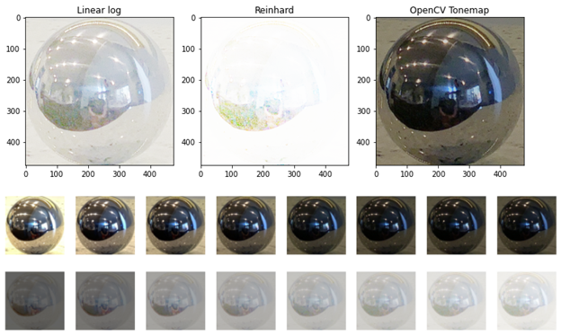

- Weighted LDR merging: weighted average of irradiance estimates from LDR images. 
 
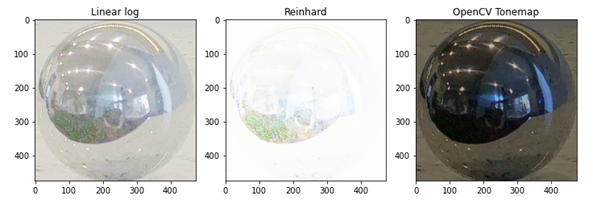

- LDR merging with camera response function estimation: calibrates the photometric responses to obtain more accurate irradiance estimates from each image. Image 3 includes the original images (second row) and respective log irradiances (third row).

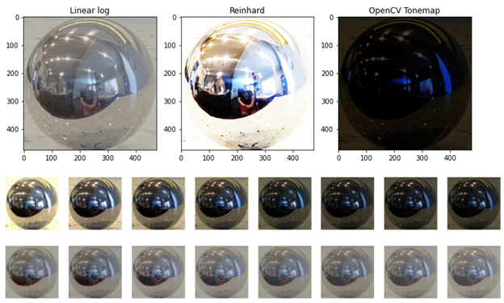

Here are the obtained plots for g versus intensity: 
 
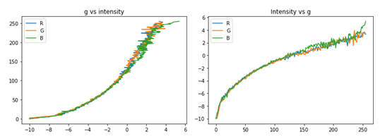

The following, is a composite image that puts together the three HDR methods together for comparison: 

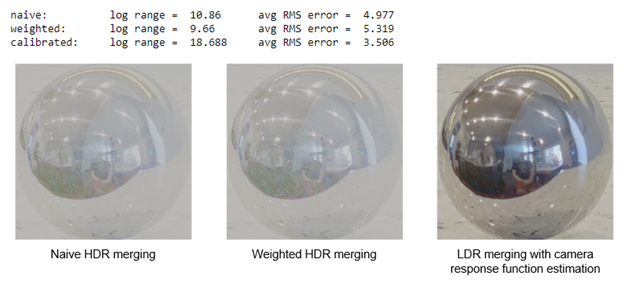

## Panoramic transformations

Here are the results obtained for the panoramic transformations of the sphere photography. 
- Normal and reflectance vectors: 
 
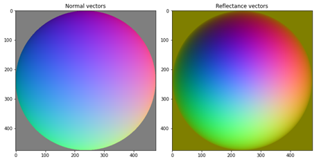

- Equirectangular image:
 
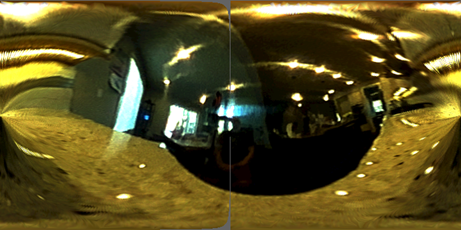

## Rendering synthetic objects

Here are the results obtained when rendering my empty background scene with synthetic 3-D objects: 

- Background image:

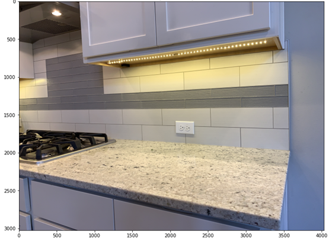

- Rendered image with objects: 
 
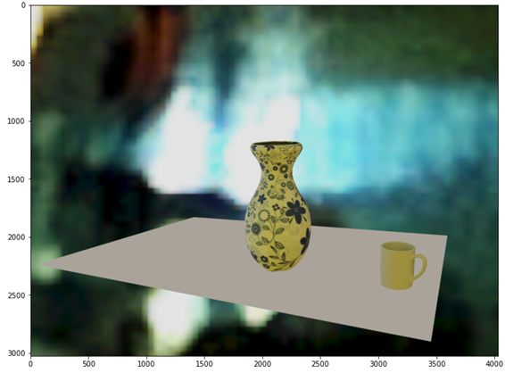

- Rendered image with local geometry: 
 
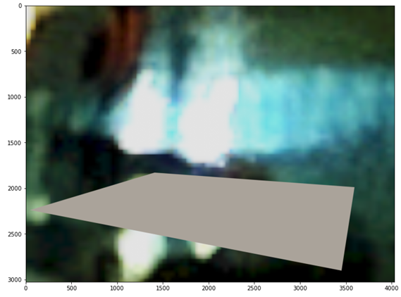

 
- Rendered mask image: 
 
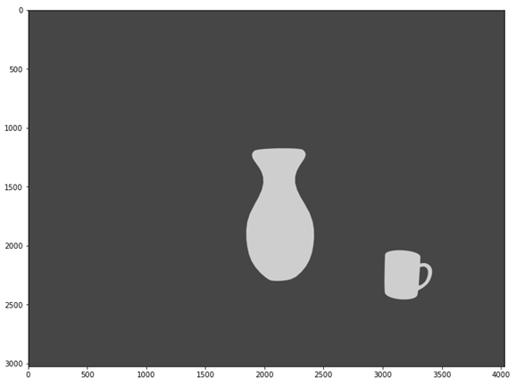

- Final composited result:
 
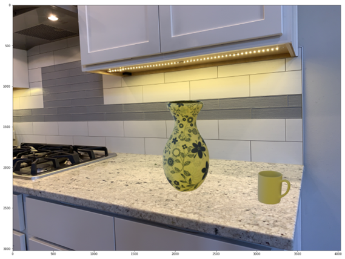

## Additional results

Here’s an additional result which uses the same objects, on a different environment map: 

- Background image: 
 
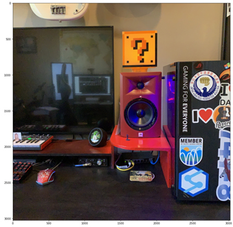

- Rendered image with objects: 
 
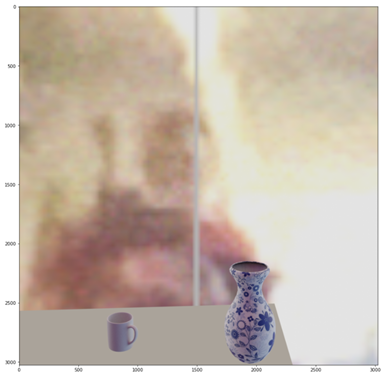

- Rendered image with local geometry: 
 
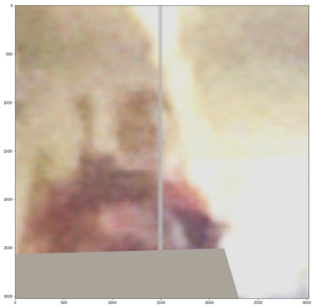

 
- Rendered mask image: 
 
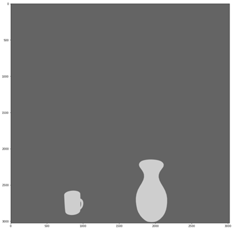

- Final composited result:
 
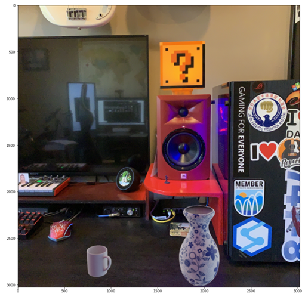

## Acknowledgments / Attribution

- All images used in this report by Pericles Rocha. 
- Synthetic 3-D objects obtained from http://www.turbosquid.com.
