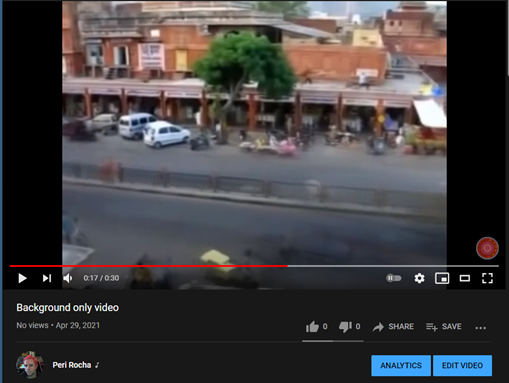

### CS 445 – Project 5 report

# Project 5: Video Stitching and Processing

## Stitch two key frames

Here are the image frames 270 and 450 with the same regions plotted on them: 

And here is the result of the normalized 3x3 homography matrix: 

[[-4.89227180e-03 -2.12267150e-04  1.00000000e+00]
 [-6.19891095e-05 -4.63824471e-03  7.65296008e-02]
 [-2.05256242e-06 -3.96279102e-08 -3.91413102e-03]]

For reference, I am also adding the warped image results for frames 270 and 450, as well as the initial panorama for two frames. 

 
## Panorama using five key frames

Here is the result of the panorama using five key frames: 
 

## Map the video to the reference plane		

The algorithm I implemented to use this problem follows three key steps: 
1. Produces the homography matrix between the key frames (except for the first and last one). 
2. Produces the homography matrix between every source frame and the next key frame to the left
3. Produces the homography between a and b. 

With the homography produced in step c, I generate the warp perspective image (using cv2) using the original frame and the homography that was produced. 

The resulting video for part 3 can be seen here: https://youtu.be/mGan7IzYvLI 
 

And here is frame 200 that is used in my video
 

## Create the background panorama

Part 4 creates a background panorama image of the scene without the moving objects. Here is my result: 
 

The algorithm builds a matrix with all 900 images and takes a median from this matrix, excluding Python “NaN” values. By calculating the median, pixel intensities that are displayed the most for a certain region (e.g.: gray pixels representing the asphalt) will have greater representation than other pixel intensities (e.g.: when a person with a white bicycle passes that pixel) for the mean across the 900 frames, therefore they will be represented in the averages. 

## Create the background movie

Part 5 uses the background panorama image obtained in part 4 and transforms the images back to a rectangular shape using the homographies calculated in part 3 to produce a “background-only” movie, which does not include the moving objects. The resulting video for part 5 can be seen here: https://youtu.be/uaQ2o2YNUas 
 

And here is frame 200 that is used in my video
 

## Create the foreground movie

Part 6 uses the frames produced to create the background-only video to create the inverse: a video that only shows the moving objects. The resulting video for part 6 can be seen here: https://youtu.be/HGKHP6Lqwy4 
 

And here is frame 200 from my foreground-only video: 
 

## Acknowledgments / Attribution

- All images provided by the exercise samples. 
- The algorithm for part 5 was inspired (but not directly copied) from https://github.com/GiattiChen/CS445/tree/master/Project%205/jieting2_proj5. The code was used to understand approaches to recover the individual frames from the background image. 
